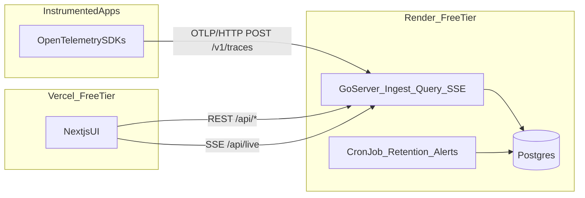
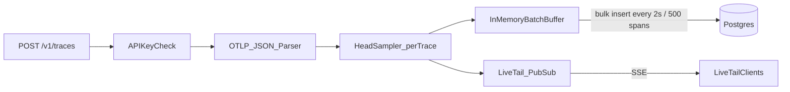

# PathTrace — Implementation

An OpenTelemetry-native distributed tracing and service observability platform.
This document describes what PathTrace does, why it exists, how it is built, and
how it is deployed.

- **Backend:** Go + Postgres → Render (free tier)
- **Frontend:** Next.js + TypeScript → Vercel (free tier)
- **Ingestion:** OpenTelemetry Protocol (OTLP/HTTP JSON + gRPC/protobuf)

---

## 1. Problem statement

Modern applications are built from many small services that call one another —
an API gateway calls a checkout service, which calls payments, inventory, a
database, and so on. When a user reports "checkout is slow" or "checkout
failed", the root cause could be in any of those services, and traditional logs
are scattered across each one.

**Distributed tracing** solves this by attaching a shared *trace ID* to a
request as it flows through every service, recording each step as a *span*
(operation + timing + status). PathTrace collects those spans and reconstructs
the full journey of a request on a single timeline, so an engineer can instantly
see:

- which service/operation consumed the most time (the **critical path**),
- where an error originated,
- how services depend on one another, and
- whether latency or error rates have crossed acceptable thresholds.

The goal of PathTrace is to deliver this core observability loop —
**ingest → search → visualize → analyze → alert** — as a small, self-contained
platform that runs comfortably on free cloud tiers.

---

## 2. Feature scope

### Core

- **OTLP/HTTP ingestion** (`POST /v1/traces`) — accepts spans from any
  OpenTelemetry SDK or collector, in OTLP JSON.
- **OTLP/gRPC ingestion** (`:4317`) — protobuf OTLP for high-throughput senders.
- **Per-project API keys** — ingestion scoped via `x-pathtrace-key`; viewers use
  the public **demo** project with no login.
- **Auto-seed demo project** — ~250 synthetic traces on first startup when empty.
- **Prometheus metrics** — `GET /metrics` for ingest/query observability.
- **Rate limiting** — per-key ingest RPM cap (configurable).
- **Optional Redis buffer** — collector → query split via Render Key Value.
- **Probabilistic head sampling** — a deterministic per-trace decision keeps or
  drops whole traces at ingest time.
- **Trace search** — filter by service, operation, tag/attribute, min/max
  duration, error-only, and time range.
- **Trace waterfall** — span tree with per-service colored timing bars, span
  detail (tags, events, references), and **critical-path** highlighting.

### Advanced (the differentiators)

- **Live Tail** — spans stream to the browser in real time over Server-Sent
  Events, like `tail -f` for telemetry.
- **Service Health scorecards** — p50/p95/p99 latency, error rate and throughput
  per service, computed with Postgres `percentile_cont`.
- **Service dependency map** — an interactive, layered graph of
  service-to-service calls derived from span parentage via a SQL self-join.
- **Error hotspots** — operations ranked by error count/rate.
- **Alert rules / SLOs** — threshold rules (e.g. `p95 latency > 250ms`,
  `error rate > 5%`) evaluated on a schedule, with a firing feed.
- **Critical-path analysis** — computed client-side from a fetched trace.
- **Trace diff** — side-by-side comparison of two traces.
- **Tag facet explorer** — browse top tag values per key.
- **Connect guide** — copy-paste OTLP endpoint and SDK snippets.
- **Landing page** — public demo entry with project selector.

### Explicitly out of scope (and why)

| Excluded | Reason |
|----------|--------|
| Kafka / streaming ingest | No free Kafka; a single instance is sufficient at demo scale |
| Tail-based / adaptive sampling | Requires large in-memory trace buffers |
| Metrics/logs backends (Prometheus, Loki) | Separate infrastructure; PathTrace is traces-only |
| Cassandra / Elasticsearch / ClickHouse | Postgres JSONB is enough at this scale |
| Horizontal autoscaling / HA | Free tier is a single instance |
| gRPC-only legacy agents | OTLP/HTTP + gRPC cover modern SDKs; Thrift/UDP excluded |

---

## 3. Architecture

PathTrace is two deployables: a Go backend on Render and a Next.js frontend on
Vercel, sharing a Postgres database.



### Write path (ingestion)



Spans are validated, sampled per trace ID (so traces stay intact), broadcast to
Live Tail subscribers immediately, and buffered for a batched bulk insert. The
batch writer flushes on a size threshold or a timer, whichever comes first.

### Read path (query + analytics)

The query layer is stateless and reads directly from Postgres. Analytics
(dependencies, health percentiles, hotspots, facets) are single SQL queries, so
there is no separate metrics store or batch job.

### Component map

| Concern | Package | Notes |
|---------|---------|-------|
| OTLP parsing | `internal/ingest` (`otlp.go`) | Decodes OTLP JSON to internal spans |
| Sampling | `internal/sampling` | Deterministic per-trace head sampling |
| Batch write + fan-out | `internal/ingest` (`writer.go`) | Buffered bulk insert + Live Tail publish |
| Live Tail hub | `internal/livetail` | In-process pub/sub, bounded per-subscriber buffers |
| Storage | `internal/storage/postgres` | pgx pool, schema migration, queries; embedded Postgres for local dev |
| Analytics | `internal/analytics` | Dependencies, health, hotspots, facets, alert metrics |
| Alerts | `internal/alerts` | Rule evaluation |
| HTTP API | `internal/query` | Routing, handlers, CORS, SSE |
| Config | `internal/config` | Env-driven configuration |

### Repository layout

```
pathtrace/
├── backend/
│   ├── cmd/
│   │   ├── server/     all-in-one (ROLE=all, default)
│   │   ├── collector/  ingest-only (ROLE=collector)
│   │   ├── query/      query + Redis worker (ROLE=query)
│   │   ├── cron/       retention sweep + alert evaluation
│   │   └── tracegen/   demo trace generator (emits OTLP)
│   ├── internal/
│   │   ├── model/      shared domain types
│   │   ├── config/     env configuration
│   │   ├── ingest/     OTLP parser + batch writer
│   │   ├── sampling/   head sampler
│   │   ├── livetail/   SSE pub/sub hub
│   │   ├── storage/postgres/  pgx store, schema, embedded PG
│   │   ├── analytics/  SQL-backed analytics engine
│   │   ├── alerts/     rule evaluator
│   │   └── query/      HTTP handlers + routing
│   └── go.mod
├── demo/otel-demo/     3-service OpenTelemetry demo (storefront/catalog/orders)
├── frontend/           Next.js App Router UI
├── .github/workflows/  CI pipeline
├── render.yaml         Render blueprint
└── implementation.md
```

---

## 4. Tech stack

| Layer | Choice | Why |
|-------|--------|-----|
| Backend language | **Go 1.26** | Strong fit for high-throughput ingest; single static binary; matches the observability ecosystem |
| HTTP | Go stdlib `net/http` (1.22 method+path routing) | No framework needed; small and fast |
| DB driver | **pgx v5** (`pgxpool`) | Efficient Postgres access with batching |
| Storage | **Postgres** (JSONB + GIN) | One store for spans, tags, and alerts; runs on Render free tier |
| Local DB | **embedded-postgres** | Real Postgres locally with zero setup (no Docker) |
| Frontend | **Next.js 15 + React 19 + TypeScript** | App Router, deploys cleanly to Vercel |
| Streaming | **Server-Sent Events** | One-way real-time stream, simpler than WebSockets, works through the single Render instance |
| Ingestion format | **OTLP/HTTP JSON** | Native OpenTelemetry wire format |

---

## 5. API specification

Base URL: the Render service (production) or `http://localhost:8080` (local).

### Ingestion

| Method | Path | Description |
|--------|------|-------------|
| POST | `/v1/traces` | OTLP/HTTP JSON trace ingest. Optional `x-pathtrace-key` header selects the project. Returns `{ "accepted": N }`. |

### Query

| Method | Path | Description |
|--------|------|-------------|
| GET | `/api/services` | Distinct service names |
| GET | `/api/operations?service=` | Distinct operations for a service |
| GET | `/api/traces` | Search; params: `service`, `operation`, `minDuration`, `maxDuration`, `onlyErrors`, `tags` (`k=v,k=v`), `start`, `end` (RFC3339), `limit`. Returns trace summaries. |
| GET | `/api/traces/{traceID}` | Full trace (all spans + summary) |

### Analytics

| Method | Path | Description |
|--------|------|-------------|
| GET | `/api/dependencies?window=1h` | Service-to-service call edges |
| GET | `/api/health/services?window=1h` | Per-service p50/p95/p99, error rate, throughput |
| GET | `/api/hotspots?window=1h&limit=20` | Operations ranked by errors |
| GET | `/api/facets?tag=&window=1h` | Top values for a tag key |

### Alerts

| Method | Path | Description |
|--------|------|-------------|
| GET | `/api/alerts` | List alert rules |
| POST | `/api/alerts` | Create a rule (`name`, `service`, `metric`, `op`, `threshold`, `windowSec`) |
| DELETE | `/api/alerts/{id}` | Delete a rule |
| GET | `/api/alerts/events` | Recent firings |

### Streaming & health

| Method | Path | Description |
|--------|------|-------------|
| GET | `/api/live` | Server-Sent Events stream of newly ingested spans |
| GET | `/healthz` | Liveness + subscriber count + sample rate |

Example ingest response and search:

```bash
curl -s -XPOST localhost:8080/v1/traces -H 'content-type: application/json' -d @trace.json
# {"accepted": 7}

curl -s 'localhost:8080/api/traces?service=payments&onlyErrors=true&limit=5'
```

---

## 6. Data model

All span data lives in a single wide `spans` table; attributes, events and
references are stored as JSONB so tag search needs no extra tables. Services and
operations are derived with `SELECT DISTINCT`, and dependencies are computed on
the fly with a self-join — no materialized views or batch jobs.

```sql
CREATE TABLE spans (
    project_id     TEXT         NOT NULL DEFAULT 'default',
    trace_id       TEXT         NOT NULL,
    span_id        TEXT         NOT NULL,
    parent_span_id TEXT,
    service_name   TEXT         NOT NULL,
    operation_name TEXT         NOT NULL,
    kind           TEXT,
    start_time     TIMESTAMPTZ  NOT NULL,
    duration_us    BIGINT       NOT NULL,
    status_code    TEXT,
    status_message TEXT,
    tags           JSONB        NOT NULL DEFAULT '{}',
    events         JSONB        NOT NULL DEFAULT '[]',
    refs           JSONB        NOT NULL DEFAULT '[]',
    PRIMARY KEY (project_id, trace_id, span_id)
);

CREATE INDEX idx_spans_service_time ON spans (project_id, service_name, start_time DESC);
CREATE INDEX idx_spans_op_time      ON spans (project_id, service_name, operation_name, start_time DESC);
CREATE INDEX idx_spans_trace        ON spans (project_id, trace_id);
CREATE INDEX idx_spans_duration     ON spans (duration_us);
CREATE INDEX idx_spans_start        ON spans (project_id, start_time DESC);
CREATE INDEX idx_spans_tags         ON spans USING GIN (tags jsonb_path_ops);
```

Alerts use two small tables (`alert_rules`, `alert_events`). Search follows a
two-step pattern: `FindTraceIDs` filters/limits to matching trace IDs, then
`GetTraces` loads all spans for those IDs and groups them into traces.

**Key analytics queries:**

- *Dependencies* — self-join child↔parent spans, group by `(parent.service,
  child.service)`.
- *Service health* — `percentile_cont(0.5|0.95|0.99) WITHIN GROUP (ORDER BY
  duration_us)` plus error-filtered counts, grouped by service.
- *Hotspots* — count of `status_code='ERROR'` per `(service, operation)`.

**Retention:** the cron job deletes spans older than `RETENTION_HOURS` to stay
within the free Postgres storage cap. (Note: a free Render Postgres also expires
30 days after creation.)

---

## 7. Frontend / UI

The UI is a purpose-built observability console, intentionally designed to look
like a serious developer tool rather than a generic template:

- Calm neutral palette with a single restrained **teal** accent; semantic
  green/amber/red reserved strictly for health/error states.
- **Monospace** for all telemetry values (trace/span IDs, durations, counts).
- Dense data tables with right-aligned numerics, thin 1px separators, small
  radii, and minimal shadows.

### Screens

| Route | Screen | Backend endpoints |
|-------|--------|-------------------|
| `/` | **Landing** — demo entry, quick links | — |
| `/connect` | **Connect** — OTLP endpoint + SDK snippets | `/api/connect` |
| `/explore` | **Explore** — filter bar + results table | `/api/services`, `/api/operations`, `/api/traces` |
| `/traces/{id}` | **Waterfall** — span tree, timing bars, critical path | `/api/traces/{id}` |
| `/diff` | **Trace Diff** — compare two traces side-by-side | `/api/traces/{id}` |
| `/facets` | **Facets** — tag value explorer | `/api/facets` |
| `/live` | **Live Tail** — real-time span stream | `/api/live` (SSE) |
| `/health` | **Service Health** — scorecards + hotspots | `/api/health/services`, `/api/hotspots` |
| `/service-map` | **Service Map** — dependency graph (SVG) | `/api/dependencies` |
| `/alerts` | **Alerts** — rules + firing feed | `/api/alerts`, `/api/alerts/events` |

All query routes accept `?project=` (sidebar **Project selector** persists choice in
`localStorage`; default is `demo`).

The trace waterfall and dependency map are rendered without heavy graph
libraries (custom layout + SVG), which keeps the bundle small.

---

## 8. Deployment

### Backend → Render

The [`render.yaml`](render.yaml) blueprint provisions three resources:

- `pathtrace-api` — Go **web service** (free). Binds `0.0.0.0:$PORT`, serves
  ingest + query + SSE. Health check at `/healthz`.
- `pathtrace-db` — **Postgres** (free, 1 GB).
- `pathtrace-cron` — **cron job** (every 5 min): retention sweep + alert
  evaluation.

Environment variables: `DATABASE_URL` (from the database), `EMBEDDED_DB=false`,
`SAMPLE_RATE`, `RETENTION_HOURS`, `BATCH_SIZE`, `CORS_ORIGIN` (your Vercel URL),
and optional `INGEST_KEYS`.

Free-tier considerations that shaped the design:

- **Ephemeral filesystem** → all state lives in Postgres.
- **Spin-down after 15 min idle** → the UI shows a reconnect state for Live Tail;
  the first request after idle incurs a cold start.
- **512 MB RAM** → capped batch size, default search limit, and bounded
  per-subscriber SSE buffers.

### Frontend → Vercel

Deploy the `frontend/` directory. Set `NEXT_PUBLIC_API_URL` to the Render API
URL. There is no server-side logic on Vercel — all data comes from the Render
API over REST/SSE.

---

## 9. Local development

No Docker or manual Postgres required — the server boots an embedded Postgres
for local development (data under `backend/.pt-data`).

```bash
# Terminal 1 — backend + embedded Postgres (auto-seeds demo project)
cd backend && go run ./cmd/server

# Terminal 2 — frontend
cd frontend && npm install && npm run dev   # http://localhost:3000

# Terminal 3+ — optional OTel demo microservices
cd demo/otel-demo && go run ./cmd/catalog
cd demo/otel-demo && go run ./cmd/orders
cd demo/otel-demo && go run ./cmd/storefront
```

The backend seeds the **demo** project on first start when empty. Legacy data
under project `default` can still be viewed via the project selector.

The `tracegen` tool and `demo/otel-demo` services both produce realistic
e-commerce-style call trees for demos.

---

## 10. Status & roadmap

Implemented and verified locally end-to-end:

- [x] OTLP HTTP + gRPC ingest, API keys, head sampling, batched writes
- [x] Redis ingest buffer + collector/query role split
- [x] Prometheus `/metrics`, ingest rate limiting
- [x] Public demo project auto-seed + landing + connect guide
- [x] Trace search + waterfall + **trace diff**
- [x] Live Tail over SSE
- [x] Service health, dependency map, **facets UI**
- [x] Alert rules + scheduled evaluation
- [x] 3-service OTel demo app + GitHub Actions CI
- [x] Render blueprint (Postgres + optional Redis + role split)

Possible future work:

- [ ] Aggregated flame graph per operation
- [ ] Saved views / shareable permalinks
- [ ] Tail-based sampling (requires larger buffers)

---

## 11. Resume talking points

- Built **PathTrace**, an OpenTelemetry-native distributed tracing and
  observability platform (Go + Postgres backend on Render, Next.js UI on Vercel).
- Implemented **OTLP/HTTP ingestion**, deterministic **per-trace head sampling**,
  and a **JSONB span store** with a GIN-indexed tag search on Postgres.
- Shipped **real-time Live Tail over Server-Sent Events**, **service-health
  scorecards** (p50/p95/p99, error rate, throughput via SQL percentiles), an
  **interactive service dependency map** (SQL self-join), **error hotspots**, and
  a **scheduled alert/SLO engine**.
- Designed a purpose-built observability UI (waterfall timeline with
  critical-path analysis, dependency graph) rendered without heavy graph
  libraries.
- Architected the whole system to run within **free cloud tiers**, handling
  ephemeral storage, idle spin-down, and memory limits explicitly.
